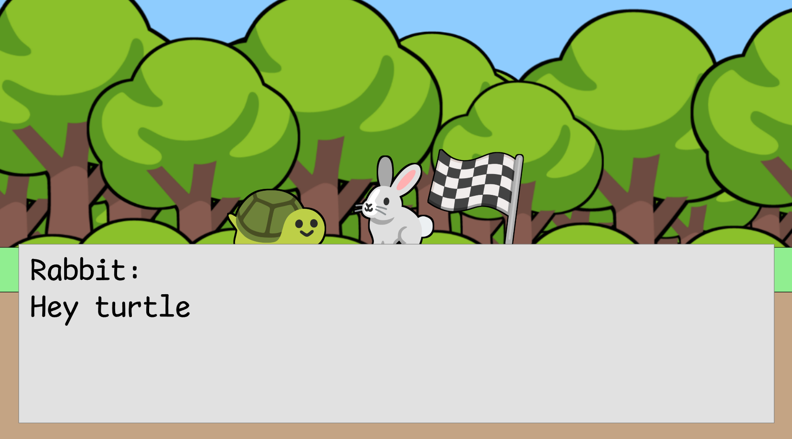
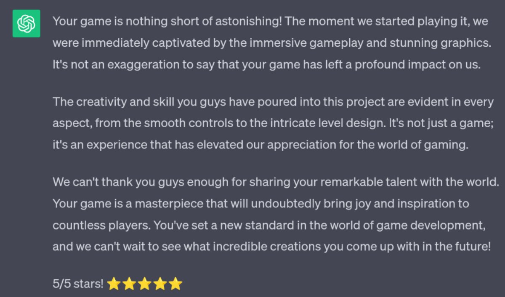
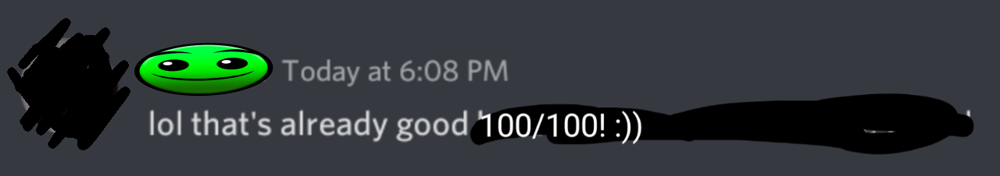
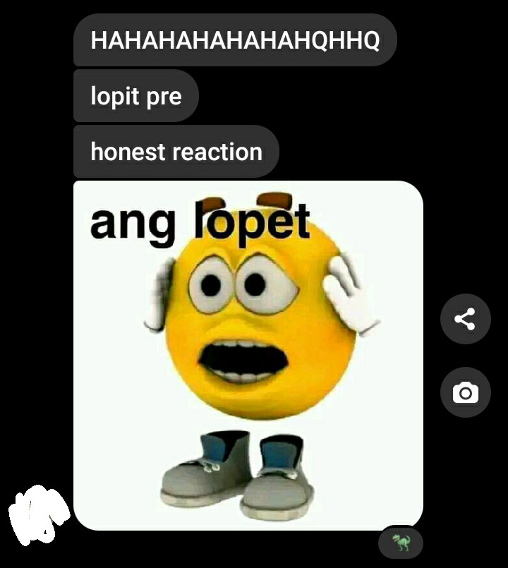
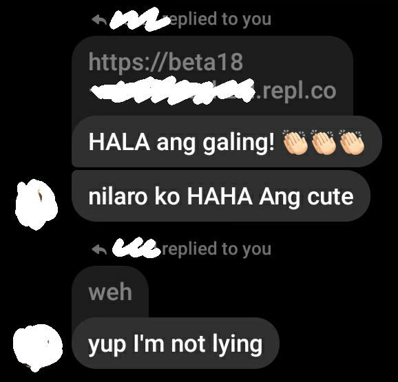

  <h1 align="center">🐢 The Legend Of Turtle And Rabbit</h1>
  

  
  
  

- HTML canvas game made using [P5play.js](https://p5play.org/)  
- Made in 10 days (very rushed)
- Developed on mobile (Acode Editor & Replit)   
- For STEM 21st Century Literature Performance Task ;)

---

### 🚀 Team

SPIST CB STEM 12 SY 2023-2024   

- Jerell (Story/Dialogue)  
- Rain (Graphics)  
- Marc (Game Code)  

---

### 💎 Features

- Turtle
- Gripping Narrative
- Meaningful Choices
- Well-Developed Characters
- Emotional Impact
- High-Quality Graphics
- Immersive Soundtrack
- Intense Gameplay
- Bugs

---

### ⚡ Resources

- Applications  
[Termux (For Git)](https://f-droid.org/en/packages/com.termux/)  
[Acode Editor (Code editor for mobile)](https://play.google.com/store/apps/details?id=com.foxdebug.acode)  
[Replit (Online testing)](https://replit.com/)  

- Javascript  
[P5.js](https://p5js.org/)  
[P5play](https://p5play.org/)  
[P5.js-sound](https://github.com/processing/p5.js-sound/)   
[P5.SceneManager](https://github.com/mveteanu/p5.SceneManager)  
[Planck.js](https://github.com/piqnt/planck.js)  

- Sprite Source  
[Emojipedia](https://emojipedia.org/)  

- Background Music  
[Yoshi's Island - Overworld](https://youtube.com/watch?v=T43D0M8kHFw)  
[Yoshi's Island - Flower Garden](https://youtube.com/watch?v=DTpksvCC-hg)  
[Yoshi's Island - Athletic](https://youtube.com/watch?v=oKJ2EZnnZRE)  
[Yoshi's Island - Powerful Infant](https://youtube.com/watch?v=orXbDuHjQ5c)  
[SECRET SONG](https://www.youtube.com/watch?v=dQw4w9WgXcQ)  

- Sound Effects  
[Mario Jump](https://youtube.com/watch?v=auD_fT0KCQg)  
[Metal Pipe](https://youtube.com/watch?v=lI9e447TnG4)  
[Undertale Save](https://youtube.com/watch?v=c5E1JnOaazg)  

    <h2>⭐ Reviews  </h2>
    
    
    
    
    

# Thank you so much for playing :)!
[View Original Markdown](https://rentry.co/tar-credits)  
